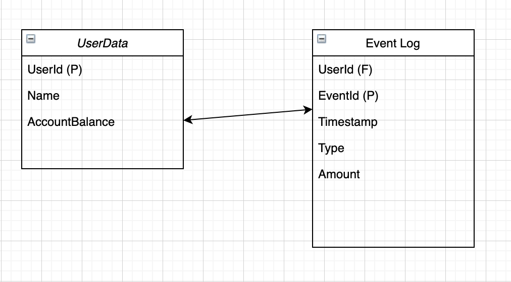

# API document for the Wallet-server

## Requirements

To build a docker you need to run in the main directory

`docker build --tag app_name .`

To run the docker-image you need run

`docker run -p 5000:5000 app_name`

This will make the client to run in `localhost:5000` and it is accessible there.

## Requests

### When a game is charged
```POST /api/v1/charge```

When game engine charges wallet, it will send a request with following payload
```json
{  
   "UserId": 123123, 
   "EventId": 321123, 
   "Amount":  1.00
}
```
Response payload

```json
{  
   "success": true,
   "UserId":  123123,
   "AccountBalance":  9.00
}
```

If `Amount` is larger than `AccountBalance` Wallet will return `HTTP 400` with following payload
```json
{
   "success": false,
   "error":  "Account balance is too low"
}
```

The client is allowed to repeat a request with same UserId and EventId as long as they have same Amount value. If the client gets a request with a repeated UserId and EventId but with different Amount it will result `HTTP 409` with following payload
```json
{
   "success": false,
   "error": "Request has a conflict with existing data."
}
```
This check is the last resort for preventing duplicate EventId occurring. The engine should take care that every event has a unique id.

The wallet is not allowed to handle purchases if the purchase amount is negative. If purchase amount is negative wallet will reply `HTTP 400` with a following payload
```json
{
   "success": false,
   "error": "Amount value is negative"
}
```

### When a game is won
```POST /api/v1/win```

If there is a win

```json
{
   "UserId":  123123,
   "WinningEventId":  312123321, 
   "Amount":  10.00
}
```

Response payload

```json
{  
   "success": true,
   "UserId":  123123,
   "AccountBalance":  19.00
}
```

The client is allowed to repeat a request with same UserId and Amount. If the client sends a request with a repeated UserId and amount but with a different WinningEventId it will result `HTTP 409` with following payload
```json
{
   "success": false,
   "error": "Request has a conflict with existing data. Duplicate winningEventId"
}
```

The client is not allowed to handle winning event if amount is negative. If amount is negative it will respond with `HTTP 400` with following payload.
```json
{
   "success": false,
   "error": "Winning amount is negative"
}
```

The client is not allowed to give a win to a user that does not exist. If engine sends a UserId that is not in the DB it will result a `HTTP 400` with following payload
```json
{
   "success": false,
   "error": "Unknown user"
}
```


# Database structure




## Safety measures

Before deploying into production a tls termination proxy between wallet and engine must be implemented. This will make a traffic encrypted and completely unaccessible, even if this would be run in a intranet environment. 

When a new user is created a unique id is created to match a users wallet. 

# Database transactions

I use isolation_level = 'IMMEADIATE' so that every database read and write within an api call is done in the same transaction. This guarantees data-integrity. So that lose threads do not read the Accountbalance simultaneously and end up writing based on stale data. Currently the API will result an uncaught error if this happens.   
